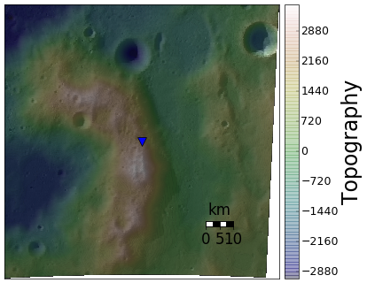
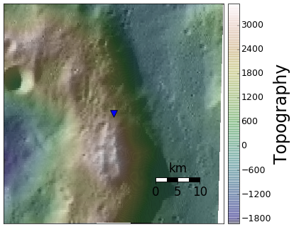

Studying specific region and making beautiful plot
==================================================

While ``PDS_Extractor`` has been designed to facilitate the extraction
of data, ``Structure``  is more related to the  visualization of these
data. It contains three **Class**:

    - Area: Use to study random region at the lunar surface
    - Crater: Use to study specific impact crater at the lunar surface
    - Dome: Use to study specific low-slope dome at the lunar surface

Area
----

This class aim to study a specific location at the surface of the Moon
through images and its topography.  Indeed, given a region of interest
defined by  its centered  (longitude,latitude) and  a radius  (km), the
class allows to plot different information:

    - ``lola_image`` realize a plot of the region topography
    - ``wac_image`` realize an image of the region
    - ``overlay`` realize an overlay of the image with its topography
    - ``draw_profile`` allows to plot different topographic profile
      along with the map where you can visualize the trace.

For  instance, if we take back  the region  of interest  and decide  to
really plot the overlay this time, we can do::

    from Structure import Area
    %matplotlib inline
    
    region = Area(120,-60,5)
    region.ppdlola = 64
    region.ppdwac = 64
    region.overlay(True, 'region.png')

This two line of code produce the image below

If you want to zoom in, simply change the size of the window::

    region.change_window(1)
    region.overlay(True, 'region_zoomed_in.png')

           
Outside  of plotting  the topography  or the  image alone,  the method
``draw_profile`` is  of particular interest  to get some  insight into
the topography. It can be used as follows::

  midlon = (region.window[0]+region.window[1])/2.0
  midlat = (region.window[2]+region.window[3])/2.0
  profile1 = (midlon,midlon,region.window[2],region.window[3]) #Vertical profile
  profile2 = (region.window[0],region.window[1],midlat,midlat) #Horizontal profile
  region.draw_profile((profile1,profile2,region.window,))
           
which results in three nice topographic profiles along with a map with
their corresponding trace.

.. image:: _static/region_profile.png
   :align: center

Crater
------

This class is specifically designed to work with lunar impact craters.
Indeed, the library integrates a table containing information about all
referenced impact craters on the Moon. It is a compilation of the data
from `Salamuniccar et  al, 2011`_, `Jozwiak et al,  2015`_ and `Losiak
et al, 2009`_.

The  table references  six features  for each  feature which  are also
set as attribute of the class:

    - name: Name of the crater is exist
    - lat0: Center latitude of the crater (degree)
    - lon0: Center longitude of the crater (degree)
    - diameter: Crater diameter (km)
    - type: 1 if the crater is a floor-fractured crater, 0 otherwise
    - radius: Radius of the crater (km)
    - index: index in the table

For instance, say we want to study the crater Copernicus, a 93 km in
diameter normal crater, simply use::

  Copernicus = Crater('name','Copernicus')

As it is based on the Area  class, it inherits all of these method and
the example  shown above  can be  taken for working  here as  well. In
particular, you can easily figure what does it looks like::

  Copernicus.overlay()

.. image:: _static/Copernicus.png
   :align: center
           
If you are not familiar with their  name, you can also use their index
in the table such that::

  RandomCrater = Crater('index',53)

Also, you  can access to the  table by using the  method ``craters`` of
this class. For instance, using::

  df = RandomCrater.craters()

will store the table in a pandas dataframe named df.

Dome
----

This class is build in a  similar fashion the the ``Crater`` class but
contains information  about low-slope domes. To  get the corresponding
table, simply used its method ``domes``.

For instance, the dome called **M13** looks like::

  M13 = Dome('name','M13')
  M13.ppdlola = 64
  M13.ppdwac = 64
  M13.overlay(True, os.path.join(imagep,'M13.png'))

.. image:: _static/M13.png
   :align: center
           
Index
-----

.. automodule:: pdsimage.Structure
    :members:
    :undoc-members:
    :show-inheritance:

       
.. _Salamuniccar et al, 2011:
    http://www.sciencedirect.com/science/article/pii/S0032063310003405)
    
.. _Jozwiak et al,  2015:
    http://dx.doi.org/10.1016/j.icarus.2014.10.052
    
.. _Losiak et al, 2009:
    http://adsabs.harvard.edu/abs/2009LPI....40.1532L
