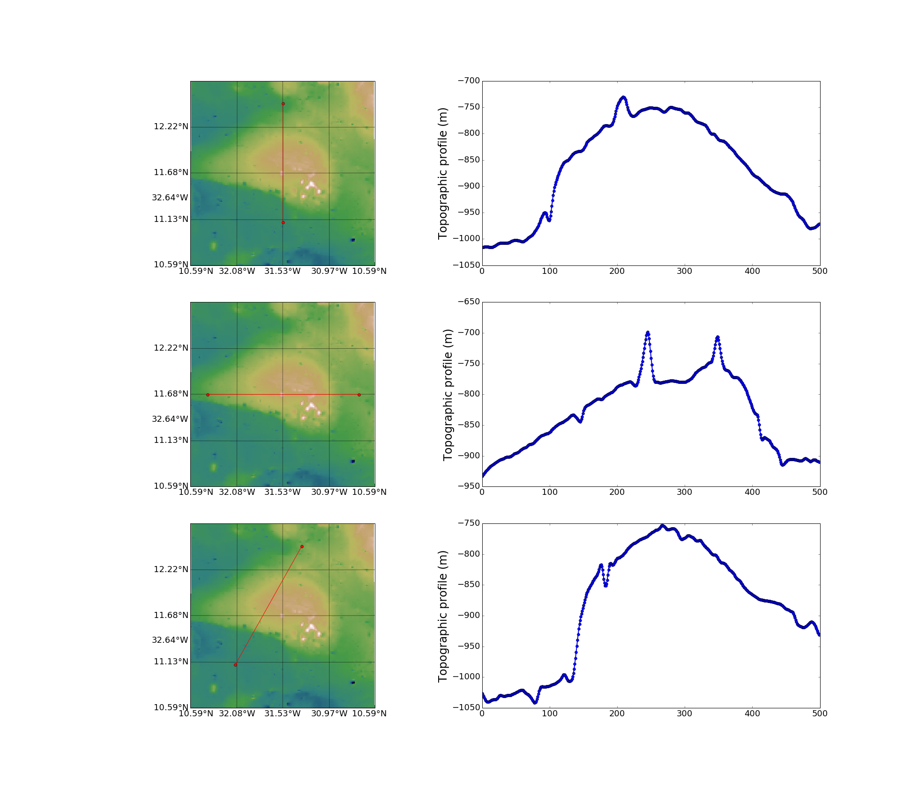

Rapid overview
========================

Import the modules
------------------

.. code:: python

    import os
    %matplotlib inline
    %load_ext autoreload
    %autoreload 2

.. code:: python

    os.chdir('/Users/thorey/Documents/repos/pdsimage/')
    from pdsimage.Structure import *
    from pdsimage.PDS_Extractor import *
    imagep = '/Users/thorey/Documents/repos/pdsimage/docs/source/_static'

Loading part of an image
--------------------------

Lola PDS Images can be found
`here <http://imbrium.mit.edu/DATA/LOLA_GDR/CYLINDRICAL/IMG/>`__ and WAC
images can be found
`here <http://lroc.sese.asu.edu/data/LRO-L-LROC-5-RDR-V1.0/LROLRC_2001/DATA/BDR/WAC_GLOBAL/>`__.

Let's say we want to load a window defined at the bottom left by
(lon0,lat0) and at the upper right by (lon1,lat1) on the 128 ppd
(pixel/degree) LOLA image.

.. code:: python

    lon0,lon1,lat0,lat1 =  0,20,-10,10
    img = BinaryTable('LDEM_16')
    X, Y, Z = img.extract_grid(lon0,lon1,lat0,lat1)

.. parsed-literal::

    PDS FILES used are in: /Users/thorey/Documents/repos/pdsimage/pdsimage/PDS_FILE

which returns an array of longitudes (X), an array of latitudes (Y) and
the grid of altitude are contained in Z. No more. For a window 10° by
10°, it runs in less than 2s on my mac book pro.

Looking at impact crater ?
--------------------------

Let's say, we want to get some detail about the crater Copernicus.

.. code:: python

    Copernicus = Crater('name','Copernicus')
    Copernicus.ppdlola = 64
    Copernicus.ppdwac = 64
    Copernicus.overlay(True,name=os.path.join(imagep,'Corpernicus2.png'))

.. parsed-literal::

    No overlap - Processing should be quick
    PDS FILES used are in: /Users/thorey/Documents/repos/pdsimage/pdsimage/PDS_FILE
    No overlap - Processing should be quick
    PDS FILES used are in: /Users/thorey/Documents/repos/pdsimage/pdsimage/PDS_FILE

.. image:: _static/Corpernicus2.png
   :align: center

let you with this nice beautiful plot which overlay a WAC image and a
LOLA image. Pixel/degree are pretty high by default.

For a specific location, the program is able to automatically detect the
corresponding patch images at the lunar surface and proposed to download
it for you. Be careful with large resolution though, downloads can be
very long.

The default window in centred on the crater with a radius equal to the
80% of the crater diameter. However this can easily be changed and for
instance, zooming in resume to

.. code:: python

    Copernicus.change_window(0.4*Copernicus.diameter)
    Copernicus.overlay(True,os.path.join(imagep,'CorpernicusZoom2.png'))

.. parsed-literal::

    No overlap - Processing should be quick
    PDS FILES used are in: /Users/thorey/Documents/repos/pdsimage/pdsimage/PDS_FILE
    No overlap - Processing should be quick
    PDS FILES used are in: /Users/thorey/Documents/repos/pdsimage/pdsimage/PDS_FILE

.. image:: _static/CorpernicusZoom2.png
   :align: center

If you prefer working with the array directly, use the method
Get\_Arrays...

.. code:: python

    Xl , Yl , Zl = Copernicus.get_arrays('Lola')
    Xw , Yw , Zw = Copernicus.get_arrays('Wac')

.. parsed-literal::

    No overlap - Processing should be quick
    PDS FILES used are in: /Users/thorey/Documents/repos/pdsimage/pdsimage/PDS_FILE
    No overlap - Processing should be quick
    PDS FILES used are in: /Users/thorey/Documents/repos/pdsimage/pdsimage/PDS_FILE

They can then be used for further analysis, histograms of the
topography...

Topographic profiles
--------------------------

The **Structure** class also contained a method which let your draw
topographic profiles (or WAC profile if you want) without effort. For
instance, if we look at an intrusive dome called 'M13' within the lunar
maria and we want to plot three topographic profile - one vertical
passing through the centre - one horizontal passing through the centre -
one oblique

.. code:: python

    M13 = Dome('name','M13')
    M13.change_window(.9*M13.diameter)
    M13.ppdlola = 64
    midlon = (M13.window[0]+M13.window[1])/2.0
    midlat = (M13.window[2]+M13.window[3])/2.0
    profile1 = (midlon,midlon,11.1,12.5)
    profile2 = (M13.window[0]+0.2,M13.window[1]-0.2,midlat,midlat)
    profile3 = (360-32.1,360-31.3,11.1,12.5)
    save_figure = os.path.join(imagep,'BaseProfile.png')
    M13.draw_profile((profile1,profile2,profile3), save = True ,name = save_figure)

.. parsed-literal::

    No overlap - Processing should be quick
    PDS FILES used are in: /Users/thorey/Documents/repos/pdsimage/pdsimage/PDS_FILE
    (328.47000000000003, 328.47000000000003, 11.1, 12.5)
    No overlap - Processing should be quick
    PDS FILES used are in: /Users/thorey/Documents/repos/pdsimage/pdsimage/PDS_FILE
    No overlap - Processing should be quick
    PDS FILES used are in: /Users/thorey/Documents/repos/pdsimage/pdsimage/PDS_FILE
    (327.55882087492716, 329.38117912507289, 11.68213679250616, 11.68213679250616)
    No overlap - Processing should be quick
    PDS FILES used are in: /Users/thorey/Documents/repos/pdsimage/pdsimage/PDS_FILE
    No overlap - Processing should be quick
    PDS FILES used are in: /Users/thorey/Documents/repos/pdsimage/pdsimage/PDS_FILE
    (327.9, 328.7, 11.1, 12.5)
    No overlap - Processing should be quick
    PDS FILES used are in: /Users/thorey/Documents/repos/pdsimage/pdsimage/PDS_FILE

